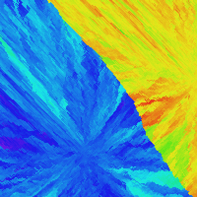

# Flower Cellular Automata

Every cell can be in one of two states: *empty* or *flower*.  
Each flower has a hue. In every iteration, flowers pick a random empty neighbor to spread to. Every time they spread, they change their hue a little bit. You repeat this process until the whole grid is full. This cellular automaton produces images like the ones below:

    

⚠️ But be careful when creating high-quality images. This cellular automaton is exponentially expensive, which means it will take much longer for larger images with smaller cell sizes.

This project includes two versions:
- **Pillow version:** Just for creating images. To install Pillow, run `pip3 install pillow`.
- **Pygame version:** Lets you watch flowers spread over the grid in real time. To install Pygame, run `pip3 install pygame-ce`.
