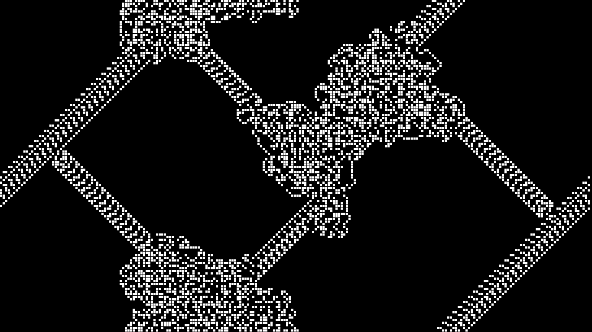

# Langton's Ant 🐜
Langton's Ant is a very simple cellular automaton with just two rules. Start with an empty 2D grid and place the ant in the middle. Every frame, ant checks color of the cell beneath it.
 
1. If the ant is on a white cell it turns **90° clockwise** , changes the color to **black** and moves forward.
2. If the ant is on a black cell it turns **90° anti-clockwise** , changes the color to **white** and moves forward.

You can read more here: https://en.wikipedia.org/wiki/Langton%27s_ant
